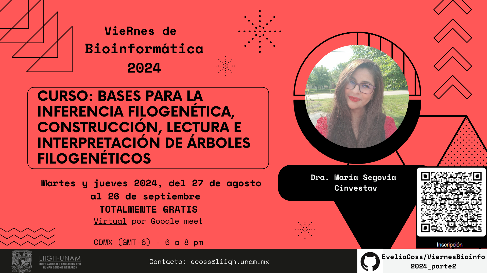

# Curso: Bases para la inferencia filogenética, construcción, lectura e interpretación de árboles filogenéticos 🐐

> Almacena este curso en tus favoritos, dando click en la estrella 🌟 de la parte superior derecha 😎. 

Instructora: Dra. María Guadalupe Segovia Ramírez (mariag.sera13@gmail.com). Github: https://github.com/mariasr13

⭐ **Objetivo general:** Que quienes lo cursen adquieran la capacidad de comprender, interpretar e construir hipótesis filogenéticas (árboles filogenéticos) con marcadores moleculares.

Curso dirigido a estudiantes y profesores de posgrado en áreas químico-biológicas. Agosto, 2024

**Totalmente GRATUITO**

## Información sobre horarios 📆

- Martes  27 de agosto; 3,10, 17, 24 de septiembre 6:00 pm a 8:00 pm  CDMX (GMT-6)
- Jueves 29 de agosto; 5, 12, 19 y 26 de septiembre 6:00 pm a 8:00 pm  CDMX (GMT-6)
- Las clases serán grabadas y se encontrarán almacenadas en este GitHub 📹.
- Curso en línea por Google meet. 

## Inscripción ✏️

Las inscripciones comienzan el jueves 15 de agosto y terminarán el lunes 28 de agosto a las 6pm.

Da click en el siguiente link: [Formato de registro](https://forms.gle/NJaPqsHFWH8bLNax7) - Registro CERRADO

Queremos recordarles que el acceso a la misma es **exclusivo para quienes se registraron previamente a través del formulario**, utilizando el correo de Gmail con el que se inscribieron. Por favor, **no compartan el enlace de la clase libremente**, ya que hemos limitado el *acceso a 100 personas*, y deseamos asegurarnos de que todos aquellos que se tomaron el tiempo de registrarse puedan participar. Es un curso gratuito y quedará grabado. 
 
## Entrega de Diplomas

Siendo parte de los "VieRnes de Bioinformática en el LIIGH-UNAM (2024)". Se otorgará un diploma a los participantes que cuenten con el 80 % de las asistencias emitido por el LIIGH-UNAM, teniendo como representante a la Dra. Maria Avila.

> **ASISTENCIAS:** Utilizaremos una extensión de Google Meet para registrar la asistencia. Esta herramienta registrará automáticamente el *nombre de usuario de Gmail, la hora de entrada y el tiempo que permanezcan en la llamada*. Les pedimos que, antes de la clase, se aseguren de que su nombre de usuario esté actualizado.
> 
> Además, les pedimos que, **si no tienen la posibilidad de asistir a la clase completa (2 horas), consideren NO ingresar**, de manera que puedan *ceder su lugar a otra persona que pueda aprovechar la clase en su totalidad* (solo hay 100 lugares en la llamada de Google meet). Queremos asegurarnos de que todos los participantes puedan disfrutar de una experiencia completa y enriquecedora de la mano de la Dra. Maria Segovia. **Respeten el espacio y el tiempo que ella también les proporcione, por favor.**

## Descripción 

El curso consta de 8 sesiones teóricas (16 hrs totales) que incluyen revisión de conceptos y teoría, generación de discusión sobre temas afines y trabajos cortos en equipo. 1 sesión de asesoría sobre proyecto de curso (2hrs). 1 sesión para presentación de proyectos (2 hrs).

- Los temas centrales que se abordarán en el curso serán:
- Tasas de mutación, substitución y marcadores moleculares.
- Lectura y construcción de árboles y modelos evolutivos.
- Métodos y herramientas para la construcción de filogenias.
- Criterios y puntos clave en filogenética.

## Contenido 📌

### **Bloque 1 (3 hrs):**
- Tasa de mutación y tasa de substitución
- Marcadores moleculares
- Ortólogos, parálogos y xenólogos
- Tipos y utilidad de los marcadores moleculares
- ¿Cómo elegir el mejor marcador molecular?
  * Material: [Sesion 1](https://drive.google.com/drive/folders/1ULsVeJioqVh5AD5uojFJz5u0Bu0EA5KU?usp=sharing)
  * Presentacion: [Bloque 1](https://drive.google.com/file/d/1GdDyQmeJ826-JTosRsIUFLESUyMeXgBP/view?usp=sharing)
  * Grabación: [Sesion 1 - 27Agosto2024](https://drive.google.com/file/d/1PuvXqUOP87qkW0ipJQfS-5exUYbxVURq/view?usp=sharing)

### **Bloque 2 (3 hrs):** 
- ¿Qué es una filogenia?
- Utilidad y propósito de las filogenias
- Leyendo el lenguaje filogenético. Alcances y limitaciones de los árboles
- Elementos del árbol
- Alineamiento de secuencias
- Modelos de partición y substitución
- Reloj molecular: Mitos y realidades
  * Material: [Sesion 2](https://drive.google.com/drive/folders/1rXx1JLbILYxoMVhgxHWDav94sP50E_Uk?usp=sharing)
  * Grabación: [Sesion 2 - 29Agosto2024](https://drive.google.com/file/d/1ukZKWeJ_kU-HkjbM37djuapFlS3ezDP_/view?usp=sharing)
  * Presentacion: [Sesion 3](https://docs.google.com/presentation/d/1p8gPWj4XnFaUFqT2-bHPXdiaqKoHszIC/edit?usp=sharing&ouid=115061201453977266962&rtpof=true&sd=true)
  * Grabación: [Sesion 3 - 29Agosto2024](https://drive.google.com/file/d/1kuHLFi46z9BnOmw2M6dvQWxPqXHg1yVz/view?usp=sharing)
  * Material: [Sesion 4](https://drive.google.com/drive/folders/1Dv7ZLFauvWaKZfzYDH1qJ0aBTKaOAgxa?usp=sharing)
  * Presentacion: [Sesion 4](https://docs.google.com/presentation/d/1k-3-wZ35iT9RA0LBNMLglKFRZ09fKD0Q/edit?usp=sharing&ouid=115061201453977266962&rtpof=true&sd=true)
  * Grabación: [Sesion 4 - 9Sep2024](https://drive.google.com/file/d/16NWVFNShakZVxRjYhdhKKFq20GQcRZgN/view?usp=sharing)
  * Grabación: [Sesion 5 - 12Sep2024](https://drive.google.com/file/d/1ytpzf8N7P8RXwSbe5UEx9-KQDucdTvr-/view?usp=sharing)

> *Entregable:*
> 
> Subir al **OneDrive el Jueves 12 de septiembre**, el link se te enviara por correo. 
> Intruccion: El material consta de 1 archivo multifasta con secuencias de un locus ([finches_cytb.fasta](https://drive.google.com/file/d/1D-rWSo_JzL5f5crVG3rJyZzrCLys4cN9/view?usp=sharing)) y un script para alinear las secuencias ([aln_msa.R](https://drive.google.com/file/d/11q_wjWakNXEhqZ69prw8YAyRY-7Lcn0O/view?usp=sharing)), calcular la matriz de distancia genética y exportar los archivos.
> El multifasta es el input para el script. El script contiene las librerías de R necesarias y está documentado. sólo debes ejecutarlo con R.
> 
> Recuerda que debes:
>	a) Cambiar la ubicación local a donde se encuentran tus archivos (el multifasta).
> b) Cambiar el método de alineamiento (eg Clustal por Muscle) así como los valores de sus parámetros (máximo de iteraciones, los gaps, el orden, etc).
>	c) Si te es posible usa un set de secuencias de tu interés.
>	d) msa contiene bastantes funciones, así que explora lo que gustes.
>	e) Remueve algunas secuencias del multifasta y vuelve a alinearlas. 
>	f) Escribe en no más de 300 palabras cuales diferencias observaste entre los métodos de alineamiento (como se agruparon, si cambió la matriz?, etc.)
> 	g) Responde brevemente las siguientes preguntas: Cuáles son los métodos de alineamiento que conoces?; cuál te parece el mejor?; por qué?
>
> NOTA: Por favor se muy muy curioso.

### **Bloque 3 (5 hrs):**
- Construyendo filogenias
- Árboles de genes vs árboles de especies
- Árboles para diferentes propósitos:
  * Delimitación de especies
  * Delimitación de poblaciones
  * Estimación del tiempo de divergencia
  * Hipótesis a nivel de evolución de loci
  * Demografía y estructura poblacional
 

### **Bloque 4 (5 hrs):**
- Métodos y herramientas para la construcción de filogenias
  * Alineamiento con muscle ácidos nucleicos y aminoácidos
  * Elección del modelo partición y substitución
  * Selección de valores y priores para los parámetros del reloj molecular, tasa de substitución/mutación y tiempo de divergencia.
  * Árboles utilizando probabilidad bayesiana (Mr. Bayes)
  * Máxima verosimilitud (RAxML)
  * Neighbor joining y árboles sin raíz, ¿cuándo utilizarlos y por qué? (Fasttree)
  * Astrid y Astral y el uso del coalescente.

## Requisitos

Conocimientos básicos de genética, evolución y biología molecular.

## Licencia y términos de uso

Prohibida la reproducción y/o instrucción de este temario y curso sin consentimiento previo del autor. Prohibido lucrar con este curso. 

-------------------
Cursos hechos con amor 💜
